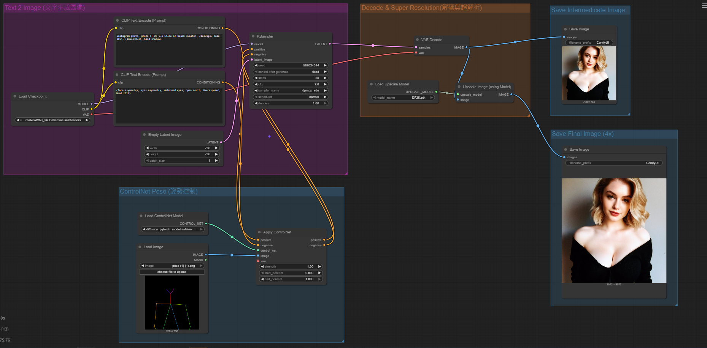

# 🧠 Advanced ComfyUI Workflow: Text + ControlNet Pose + Super Resolution

This project is an advanced AI image generation workflow built using ComfyUI. It integrates the following components:

- Text-to-Image generation
- ControlNet pose control
- High-quality image super resolution

It is suitable for portfolio presentation, AI portrait creation, or research purposes.

---

## 📌 Features

✅ Supports natural language prompt input  
✅ Integrates ControlNet pose images to guide output poses  
✅ Uses the Realistic Vision model to generate photorealistic portraits  
✅ Outputs images at 768x768 resolution and upscales to 3072x3072  
✅ Supports both intermediate and final image saving

---

## 🗂️ Workflow Example

  
> The image above shows the ComfyUI example workflow, visualizing each stage of image generation.

---

## 🔧 Models Used

| Type             | Model Name                                     |
|------------------|------------------------------------------------|
| Text-to-Image    | `realisticVisionV50_v40Bakedvae.safetensors`   |
| ControlNet       | `control_v11p_sd15_openpose.pth`               |
| Upscaler Model   | `RealSR DF2K 4x`                                |

---

## 🖼️ Output Image Explanation

- Intermediate image (768x768): Used to preview generation quality  
- Final output image (3072x3072): Produced after super-resolution

---
