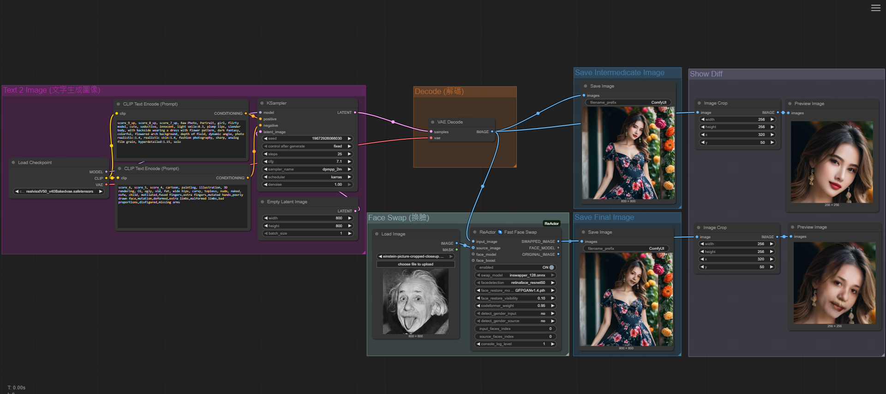

# 🧠 Advanced ComfyUI Workflows

This project contains advanced AI image generation workflows built with ComfyUI. It currently includes:

- Text + ControlNet Pose + Super Resolution Workflow
- SwapFace Workflow

---

## Table of Contents

- [Text + ControlNet Pose + Super Resolution](#text--controlnet-pose--super-resolution)
- [SwapFace Workflow](#swapface-workflow)

---

## Text + ControlNet Pose + Super Resolution

This workflow integrates text-to-image generation, pose control, and high-quality super resolution. It is suitable for portfolio presentation, AI portrait creation, or research purposes.

### Features

- Natural language prompt input
- Integrates ControlNet pose images to guide output poses
- Uses the Realistic Vision model for photorealistic portraits
- Outputs images at 768x768 and upscales to 3072x3072
- Supports saving both intermediate and final images

### Workflow Example

### Models Used

| Type             | Model Name                      |
|------------------|----------------------------------------------|
| Text-to-Image    | realisticVisionV50_v40Bakedvae.safetensors   |
| ControlNet       | control_v11p_sd15_openpose.pth               |
| Upscaler Model   | RealSR DF2K 4x                               |

---

## SwapFace Workflow

This workflow allows you to swap faces between two images, suitable for creative composition, portrait replacement, and more.

### Features

- Supports custom source and target face images
- High-quality face fusion
- Useful for portrait creation, fun composition, etc.

### Workflow Example

### Models Used

| Type           | Model Name         |
|----------------|----------------------------------|
| Face Swapping  | GFPGANv1.4.pth           |

---

## Output Image Explanation

- Intermediate image (e.g., 768x768): Used to preview generation quality
- Final output image (e.g., 3072x3072): Produced after super-resolution or face swap

---
