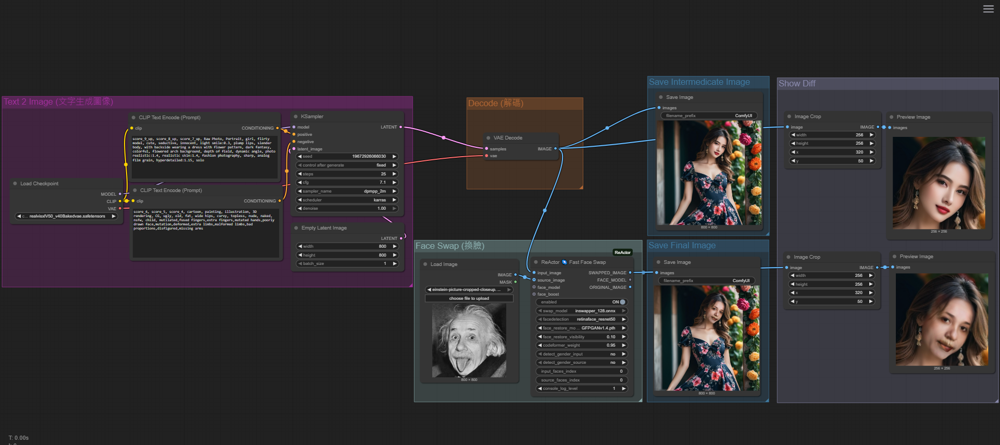

# 🧠 進階 ComfyUI 工作流

本專案包含基於 ComfyUI 的進階 AI 影像生成工作流，目前包括：

- 文字 + ControlNet 姿勢 + 超解析度工作流
- SwapFace 臉部交換工作流

---

## 目錄

- [文字 + ControlNet 姿勢 + 超解析度](#文字--controlnet-姿勢--超解析度)
- [SwapFace 臉部交換工作流](#swapface-臉部交換工作流)

---

## 文字 + ControlNet 姿勢 + 超解析度

此工作流整合了文字生成、姿勢控制與高品質超解析度，適合作品集展示、AI 肖像創作或研究用途。

### 特色

- 支援自然語言提示輸入
- 整合 ControlNet 姿勢圖像以引導輸出姿勢
- 使用 Realistic Vision 模型產生寫實人像
- 輸出影像為 768x768 並可放大至 3072x3072
- 支援儲存中間與最終影像

### 工作流範例

### 使用模型

| 類型           | 模型名稱                           |
|----------------|----------------------------------------------|
| 文字轉影像     | realisticVisionV50_v40Bakedvae.safetensors   |
| ControlNet     | control_v11p_sd15_openpose.pth               |
| 超解析度模型   | RealSR DF2K 4x                               |

---

## SwapFace 臉部交換工作流

此工作流可將兩張圖片中的臉部進行交換，適合創意合成、肖像替換等應用。

### 特色

- 支援自訂來源與目標臉部圖片
- 高品質臉部融合
- 適用於肖像創作、趣味合成等

### 工作流範例

### 使用模型

| 類型         | 模型名稱              |
|--------------|----------------------------------|
| 文字轉影像     | realisticVisionV50_v40Bakedvae.safetensors   |
| 臉部交換     | GFPGANv1.4.pth                |

---

## 輸出影像說明

- 中間影像（如 768x768）：用於預覽生成品質
- 最終輸出影像（如 3072x3072）：經超解析度或臉部交換後產生

---

