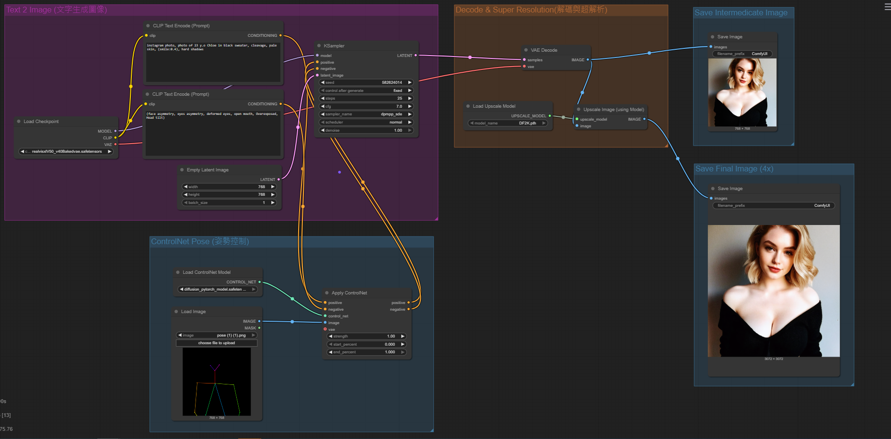

# 🧠 ComfyUI 高階圖像生成流程：文本 + ControlNet 姿勢 + 超解析

本專案為一個使用 ComfyUI所建立的高階 AI 圖像生成流程。結合了以下技術模組：

- Text-to-Image 文本生成圖像
- ControlNet 姿勢控制
- 高品質圖像超解析（Super Resolution）

適合用於履歷作品展示、AI 人像生成創作或研究目的。

---

## 📌 功能特色

✅ 支援自然語言 Prompt 輸入  
✅ 結合 ControlNet 姿勢圖控制輸出圖像姿勢  
✅ 使用 Realistic Vision 模型生成寫實人像  
✅ 輸出 768x768 圖像，並透過超解析升級至 3072x3072  
✅ 支援 intermediate & final 圖像儲存

---

## 🗂️ 範例流程圖 (Workflow)

  
> 上圖為本 ComfyUI 範例流程，可視覺化圖像生成各階段。

---

## 🔧 使用模型

| 類型           | 模型名稱                                       |
|----------------|------------------------------------------------|
| 文本轉圖模型   | `realisticVisionV50_v40Bakedvae.safetensors`   |
| ControlNet     | `control_v11p_sd15_openpose.pth`               |
| Upscaler 模型  | `RealSR DF2K 4x`|

---

## 🖼️ 圖像輸出說明

- 中間圖像（768x768）：用於預覽生成品質  
- 最終輸出圖像（3072x3072）：經過超解析後產生的最終產出圖。

---

